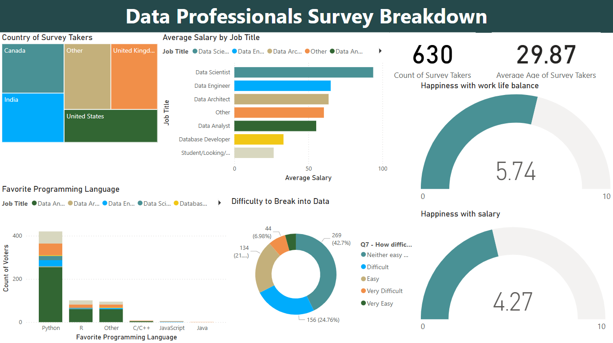

# Data Professionals Survey Dashboard

## 📊 Overview

This Power BI report visualises the global **distribution, compensation, job‑satisfaction, and career‑switching trends** of data professionals. It consolidates survey responses into an interactive one‑page dashboard, enabling quick exploration by job title, country, and gender.



## 🗂️ Dataset

* **Source:** [Data Professional Survey Breakdown ― Kaggle](https://www.kaggle.com/datasets/ahmedmohamedibrahim1/data-professional-survey-breakdown) *(collected by ****Alex Freberg**** a.k.a. Alex the Analyst)*
* **Sample size:** ≈ 630 respondents worldwide
* **Key fields:**

  * `Job Title`
  * `Country`
  * `Salary (USD)`
  * `Work/Life Balance Rating (1‑10)`
  * `Salary Satisfaction Rating (1‑10)`
  * `Switching to Data Career` *(Yes/No)*

## ✨ Key Insights

| # | Insight                                                                                           |
| - | ------------------------------------------------------------------------------------------------- |
| 1 | **Highest‑earning roles:** Data Scientists & ML Engineers top the median‑salary table.            |
| 2 | **Gender pay gap:** Male pros earn ≈ 8 % more than female peers in equivalent roles.              |
| 3 | **Job satisfaction:** Global average is **5.7 / 10**; strongly correlated with work‑life balance. |
| 4 | **Career switching:** Survey shows the highest transition rates in 🇮🇳 India and 🇺🇸 USA.       |

*(Explore these on the Cards, Gauges, Bar/Column charts, Treemap & Donut inside the report.)*

## 🛠️ Report Structure & Tech

| Page          | Visuals                                                                               | Purpose                         |
| ------------- | ------------------------------------------------------------------------------------- | ------------------------------- |
| **Dashboard** | 2 Cards · 2 Gauges · Bar Chart · Column Chart · Treemap · Donut Chart · Title Textbox | Executive summary of the survey |

* **Power Query** cleans and shapes raw CSV data.
* **DAX measures** calculate salary averages, medians & satisfaction scores.
* Styling follows the built‑in **Highrise** Power BI theme.

## 🚀 Getting Started

1. **Clone** the repo

   ```bash
   git clone https://github.com/<your‑handle>/data‑professionals‑survey.git
   cd data‑professionals‑survey
   ```
2. **Open** `data-professionals-breakdown-visualization.pbix` with **Power BI Desktop** (June 2025 or later).
3. Press **Refresh** (`Ctrl + R`) if you plug in updated data.

## 📁 Repository Layout

```
.
├── data-professionals-breakdown-visualization.pbix
├── images/
│   └── dashboard.png         # add your screenshot here
├── README.md                 # you are here
└── LICENSE                   # MIT by default
```


## 📝 License

Distributed under the **MIT License**. See `LICENSE` for details.

## 🙏 Acknowledgements

* **Alex Freberg (@AlexTheAnalyst)** ― for making the dataset public.
* Power BI Community.

> *Data professionals keep the world’s data flowing—this dashboard is a snapshot of their journey.*
